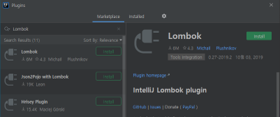

# Things that you will prepare

- JDK 8 or later
  - JDK 11 recommended
  - <https://adoptopenjdk.net/releases.html?variant=openjdk11&jvmVariant=hotspot>
- IntelliJ IDEA Community Edition
  - Latest Version is 2019.2.4
  - <https://www.jetbrains.com/idea/download/>

## IntelliJ IDEA Setup

### Setup JDK Version

1. Start IntelliJ and Open [Configure] – [Structure for New Projects]

    

2. Now you can see \<No SDK\> in Project SDK

    

3. Click [New] Button and select [JDK]

4. Select your JAVA_HOME directory

    

5. You can check your JDK applied properly

    

### Install Plugins

1. Lombok

    

    1. After install Lombok plugin, you must turn on [Enable annotation processing] in Setup

        

2. Protobuf Support

    

## Download skeleton demo project

### Go to https://start.spring.io/ and follow the steps below

1. Project - [Gradle Project]

2. Language – [Java]

3. Spring Boot – [2.2.0]

4. Project Metadata

   - Group – com.linecorp.devday.handson
   - Artifact – demo
   - Expand [Options] and set Java version to 11

5. Dependencies

   - Spring Reactive Web
   - Lombok

6. Click Generate to download skeleton project

### If you feel difficult to follow these steps, just clone below repository

- https://github.com/joonhaeng/line-devday-2019-hands-on-src
  - checkout [chatper-0] branch

## Import demo project to IntelliJ

### Import Source Code

1. Extract demo.zip to any directory that you want

2. Select [Import Project] in IntelliJ and select directory that extract demo.zip file

    

3. Select [Gradle] and click [Finish]

    

### Run Configuration

1. After finish import, you can see Project tree on left

    

2. Open src – main – java – com.linecorp.devday.handson.demo and you find DemoApplication class at last

3. Right click on DemoApplication, and select [Run ‘DemoApplication.main()’]

4. Show up Spring Logo, and you’re now entering Spring Boot World!

    
